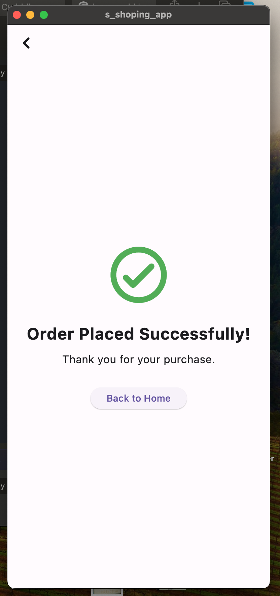

# Shopping Cart App

A Flutter application that simulates a simple shopping experience with product listing and checkout functionality.

## Features

- Bottom navigation bar with Products and Checkout tabs
- Product listing page
- Checkout page with added items
- Add/Remove items from cart
- Order confirmation screen

## Screenshots

### Product Page

### Checkout Page

### Confirmation Page

## Setup Instructions

1. Clone the repository:
git clone https://github.com/adewuyito/s_shoping_app.git

2. Navigate to the project directory:
cd s_shoping_app

3. Install dependencies:
flutter pub

4. Run the app:
flutter run

## Download

You can download the latest APK version of the app here: [Download APK](release/app-release.apk)

## How to Use

1. **Products Screen**: Browse through the list of available products. Tap the "Add to Cart" button to add an item to your checkout list.

2. **Checkout Screen**: View items you've added to your cart. You can remove items by tapping the remove button next to each item. The total price is displayed at the bottom.

3. **Order Confirmation**: On the Checkout screen, tap the "Place Order" button to navigate to the Order Successful screen.

## Technologies Used

- Flutter
- Dart