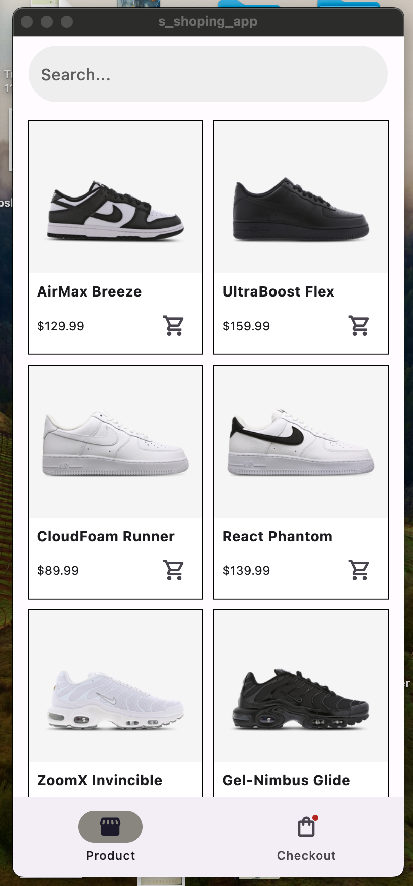
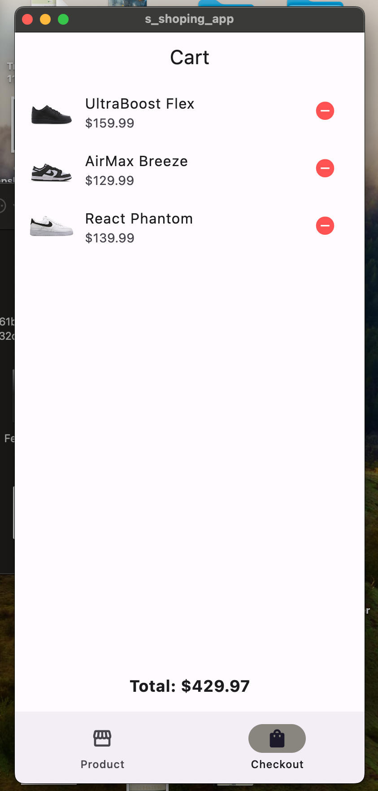

#### Requirements:
A bottom navigation bar consisting of Products and Checkout items.
Products will displays the list of products/items, Checkout will display the products added for checkout.
Have the functionality of adding and removing items to the Checkout .
A button that navigates to an Order Successful screen from the Checkout screen.

#### Acceptance Criteria:
No Third-party Dependencies: Ensure that the application is built without importing any third-party packages, plugins, or libraries. Utilize only native functionalities and components of your chosen mobile platform/framework.
Intuitive and Adaptive UI: The application should have a user-friendly and intuitive user interface, with clear labelling and easy navigation and spacing.
Proper README File: it should contain proper setup instructions, app screenshots, apk download link e.t.c.

#### Submission Requirements:
GitHub Repository: Host your application's source code on your GitHub repository.
Appetize.io Showcase: Use Appetize.io to provide a virtualized demonstration of the release version of your app and ensure it doesn't crash when launching the app.
Deadline: Tuesday, 2th July - 11:59pm WAT

# Shopping Cart App

A Flutter application that simulates a simple shopping experience with product listing and checkout functionality.

## Features

- Bottom navigation bar with Products and Checkout tabs
- Product listing page
- Checkout page with added items
- Add/Remove items from cart
- Order confirmation screen

## Screenshots

### Product Page

### Checkout Page

## Setup Instructions

1. Clone the repository: